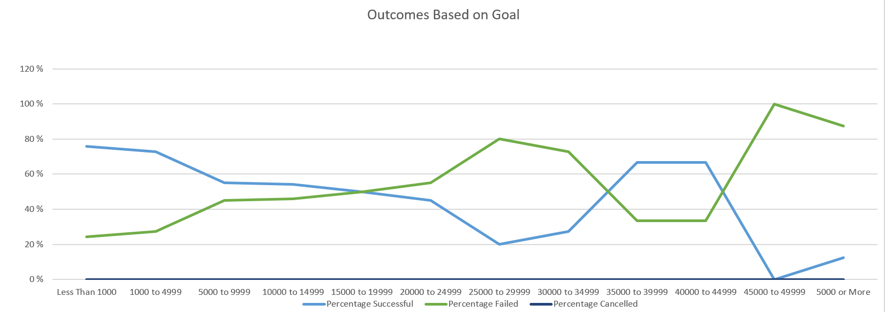

# Kickstarting with Excel

## Overview of Project

### Purpose
The purpose of the project is to help the up and coming playwrite, Louise, analyze her crowd funding campain of her play 'Fever'. The project uses Excel to organize, sort and analyze her crowdfunding data to determine what factors make a campaign successful.

## Analysis and Challenges

Some of the challenges:
- The data had some data clumped together in one column, like category/subcategory that needed some messaging/cleanup to be usable.
- Another data cleanup was needed for the launch dates that came in Unix format that no one can understand.

### Analysis of Outcomes Based on Launch Date

- 

Results and conclusions of Outcome based on Launch dates shows that:
- Campains are more likely to succed in the April-August time frame. Perhaps people are more eager to participate and are in a better mood in the nice Summer season
- Campaign have highest chance of failure in December. This may be due to the holiday season and being stressed financially by holiday shopping to donate to the campaigns.

### Analysis of Outcomes Based on Goals
- 
Results and conclusions of Outcomes Based on Goals:
- Campaigns has the highest percentage of success with a goal less than $1000 or when the goal is between $40,000 and $45,000
- Avoid goals of $25,000 and $30,000 and also over $45,000. Campaigns with these goals have higher chance of failure.
- No campaigns were cancelled regardless of goals and outcomes. Perhaps people running campaigns should watch more early indicators of failure so the can cancel campaigns that seem to be failing before more money is lost there

### Challenges and Difficulties Encountered

- What are some limitations of this dataset?
- 
  The data is the dataset is not recent. The most recent data is from 2017. So, if Louise is launching her campaign now she may not see recent changes in audience responses and changes in the environment (like COVID limiting events and gathering)
  
- What are some other possible tables and graphs that we could create?
- 
  A table with descriptive statistics would give a quick and useful overview of the trends and outcomes
  
  - 
  
