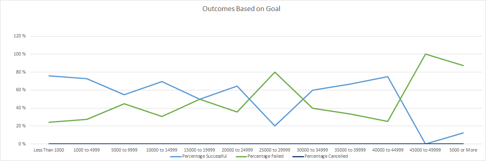

# Kickstarting with Excel

## Overview of Project

### Purpose
The purpose of the project is to help the up and coming playwrite, Louise, analyze her crowd funding campain of her play 'Fever'. The project uses Excel to organize, sort and analyze her crowdfunding data to determine what factors make a campaign successful.

## Analysis and Challenges

Some of the challenges:
- The data had some data clumped together in one column, like category/subcategory that needed some messaging/cleanup to be usable.
- Another data cleanup was needed for the launch dates that came in Unix format that no one can understand.

### Analysis of Outcomes Based on Launch Date

Results of Outcome based on Launch dates shows that:
- Campains are more likely to succed in the April-August time frame. Perhaps people are more eager to participate and are in a better mood in the nice Summer season
- Campaign have highest chance of failure in December. This may be due to the holiday season and being stressed financially by holiday shopping to donate to the campaigns.
- 

### Analysis of Outcomes Based on Goals

### Challenges and Difficulties Encountered

## Results

- What are two conclusions you can draw about the Outcomes based on Launch Date?

- What can you conclude about the Outcomes based on Goals?

- What are some limitations of this dataset?

- What are some other possible tables and/or graphs that we could create?
